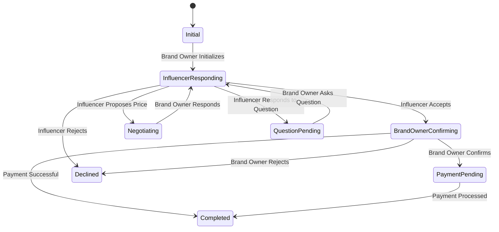

# Complete Business Flow Guide

## 🎯 Overview

This guide provides a comprehensive understanding of all business flows, automated conversations, and state management in the system. The backend handles all complex business logic while the frontend focuses on user interaction and display.

---

## 🏗️ System Architecture Overview

### Core Components
```
┌─────────────────┐    ┌──────────────────┐    ┌─────────────────┐
│   Frontend      │    │     Backend      │    │    Database     │
│   (Display)     │◄──►│  (Business       │◄──►│   (State)      │
│                 │    │   Logic)         │    │                 │
└─────────────────┘    └──────────────────┘    └─────────────────┘
         │                       │                       │
         │                       │                       │
         ▼                       ▼                       ▼
┌─────────────────┐    ┌──────────────────┐    ┌─────────────────┐
│   WebSocket     │    │  Flow Service    │    │  Conversations  │
│  (Real-time)    │    │ (Automation)     │    │   & Messages    │
└─────────────────┘    └──────────────────┘    └─────────────────┘
```

### Data Flow
1. **User Action** → Frontend captures user input
2. **API Call** → Frontend sends request to backend
3. **Business Logic** → Backend processes and updates state
4. **Database Update** → State changes saved to database
5. **Real-time Update** → WebSocket notifies frontend
6. **UI Update** → Frontend reflects new state

---

## 🔄 Automated Bid Flow - Complete State Machine

### Flow States & Transitions



### State Details

#### 1. **Initial State**
- **Trigger:** Brand owner initializes conversation
- **Actions Available:** Brand owner only
- **Next States:** InfluencerResponding
- **Description:** Conversation created, waiting for influencer response

#### 2. **Influencer Responding**
- **Trigger:** Influencer needs to take action
- **Actions Available:** Influencer only
- **Next States:** BrandOwnerConfirming, Negotiating, QuestionPending, Declined
- **Description:** Influencer can accept, reject, propose price, or answer questions

#### 3. **Brand Owner Confirming**
- **Trigger:** Brand owner needs to confirm
- **Actions Available:** Brand owner only
- **Next States:** PaymentPending, Completed, Declined
- **Description:** Brand owner confirms collaboration or rejects

#### 4. **Negotiating**
- **Trigger:** Price negotiation in progress
- **Actions Available:** Brand owner only
- **Next States:** InfluencerResponding
- **Description:** Brand owner proposes new price, waits for influencer response

#### 5. **Question Pending**
- **Trigger:** Question asked, waiting for answer
- **Actions Available:** Influencer only
- **Next States:** InfluencerResponding
- **Description:** Influencer must answer question before proceeding

#### 6. **Payment Pending**
- **Trigger:** Payment process initiated
- **Actions Available:** System only
- **Next States:** Completed
- **Description:** Payment processing, conversation locked

#### 7. **Completed**
- **Trigger:** Payment successful
- **Actions Available:** None (read-only)
- **Next States:** None (final state)
- **Description:** Collaboration confirmed, payment processed

#### 8. **Declined**
- **Trigger:** Either party rejects
- **Actions Available:** None (read-only)
- **Next States:** None (final state)
- **Description:** Collaboration rejected, conversation closed

---

## 💬 Message Types & Business Logic

### 1. **Automated Messages**
```typescript
interface AutomatedMessage {
  message_type: 'automated';
  content: string;
  metadata: {
    flow_state: string;
    action_required: boolean;
    awaiting_role: string;
    template_type: string;
    business_context: any;
  };
}
```

**Business Logic:**
- Generated automatically by backend
- Cannot be edited or deleted
- Drive conversation flow
- Include action buttons when needed

### 2. **Action Messages**
```typescript
interface ActionMessage {
  message_type: 'action';
  content: string;
  metadata: {
    action_type: 'button' | 'input' | 'choice';
    action_data: {
      buttons?: ButtonConfig[];
      input_fields?: InputFieldConfig[];
      choices?: ChoiceConfig[];
    };
    flow_context: any;
    expires_at?: string;
  };
}
```

**Business Logic:**
- Require user interaction
- Time-sensitive (can expire)
- Drive state transitions
- Include validation rules

### 3. **User Messages**
```typescript
interface UserMessage {
  message_type: 'text' | 'media' | 'document';
  content: string;
  metadata: {
    user_role: string;
    flow_state: string;
    is_automated: boolean;
  };
}
```

**Business Logic:**
- Can be sent by users
- Subject to flow state validation
- May trigger automated responses
- Include role-based permissions

---

## 🎯 Complete Flow Examples

### Example 1: Successful Collaboration Flow

#### Step 1: Brand Owner Initializes
```typescript
// Frontend calls
POST /api/bids/automated/initialize
{
  "bid_id": "bid_123",
  "influencer_id": "inf_456",
  "initial_message": "Hi! I'd like to work with you on this campaign."
}

// Backend response
{
  "success": true,
  "data": {
    "conversation": { /* conversation object */ },
    "flow_state": "influencer_responding",
    "awaiting_role": "influencer",
    "automated_messages": [
      {
        "content": "Hi! I'd like to work with you on this campaign.",
        "message_type": "automated",
        "metadata": { "flow_state": "initial" }
      },
      {
        "content": "Please review the offer and let me know if you're interested.",
        "message_type": "action",
        "metadata": {
          "action_type": "button",
          "action_data": {
            "buttons": [
              { "text": "Accept Offer", "action": "accept" },
              { "text": "Negotiate Price", "action": "negotiate" },
              { "text": "Ask Question", "action": "question" }
            ]
          }
        }
      }
    ]
  }
}
```

#### Step 2: Influencer Accepts
```typescript
// Frontend calls
POST /api/bids/automated/influencer-action
{
  "conversation_id": "conv_789",
  "action_type": "accept",
  "action_data": {}
}

// Backend response
{
  "success": true,
  "data": {
    "action_result": "accepted",
    "next_flow_state": "brand_owner_confirming",
    "awaiting_role": "brand_owner",
    "new_messages": [
      {
        "content": "Great! I accept the offer. Looking forward to working together!",
        "message_type": "automated",
        "metadata": { "flow_state": "influencer_responding" }
      },
      {
        "content": "Please confirm to proceed with payment and collaboration details.",
        "message_type": "action",
        "metadata": {
          "action_type": "button",
          "action_data": {
            "buttons": [
              { "text": "Confirm & Proceed to Payment", "action": "confirm" },
              { "text": "Cancel", "action": "cancel" }
            ]
          }
        }
      }
    ]
  }
}
```

#### Step 3: Brand Owner Confirms
```typescript
// Frontend calls
POST /api/bids/automated/final-confirmation
{
  "conversation_id": "conv_789",
  "confirm": true,
  "payment_method": "stripe"
}

// Backend response
{
  "success": true,
  "data": {
    "payment_initiated": true,
    "payment_url": "https://stripe.com/checkout/...",
    "conversation": { /* updated conversation */ }
  }
}
```

### Example 2: Price Negotiation Flow

#### Step 1: Influencer Proposes Price
```typescript
// Frontend calls
POST /api/bids/automated/influencer-action
{
  "conversation_id": "conv_789",
  "action_type": "propose_amount",
  "action_data": {
    "proposed_amount": 1500
  }
}

// Backend response
{
  "success": true,
  "data": {
    "action_result": "price_proposed",
    "next_flow_state": "negotiating",
    "awaiting_role": "brand_owner",
    "new_messages": [
      {
        "content": "I'd like to propose $1,500 for this collaboration.",
        "message_type": "automated",
        "metadata": { "flow_state": "influencer_responding" }
      },
      {
        "content": "Please review the proposed amount and respond.",
        "message_type": "action",
        "metadata": {
          "action_type": "button",
          "action_data": {
            "buttons": [
              { "text": "Accept $1,500", "action": "accept" },
              { "text": "Counter Offer", "action": "counter" },
              { "text": "Reject", "action": "reject" }
            ]
          }
        }
      }
    ]
  }
}
```

#### Step 2: Brand Owner Counters
```typescript
// Frontend calls
POST /api/bids/automated/brand-owner-action
{
  "conversation_id": "conv_789",
  "action_type": "negotiate",
  "action_data": {
    "proposed_amount": 1200
  }
}

// Backend response
{
  "success": true,
  "data": {
    "action_result": "price_countered",
    "next_flow_state": "influencer_responding",
    "awaiting_role": "influencer",
    "new_messages": [
      {
        "content": "I can offer $1,200 for this collaboration.",
        "message_type": "automated",
        "metadata": { "flow_state": "negotiating" }
      },
      {
        "content": "Please let me know if you accept this offer.",
        "message_type": "action",
        "metadata": {
          "action_type": "button",
          "action_data": {
            "buttons": [
              { "text": "Accept $1,200", "action": "accept" },
              { "text": "Propose Another Amount", "action": "propose" },
              { "text": "Reject", "action": "reject" }
            ]
          }
        }
      }
    ]
  }
}
```

### Example 3: Question & Answer Flow

#### Step 1: Brand Owner Asks Question
```typescript
// Frontend calls
POST /api/bids/automated/brand-owner-action
{
  "conversation_id": "conv_789",
  "action_type": "ask_question",
  "action_data": {
    "question": "What's your experience with beauty products?"
  }
}

// Backend response
{
  "success": true,
  "data": {
    "action_result": "question_asked",
    "next_flow_state": "question_pending",
    "awaiting_role": "influencer",
    "new_messages": [
      {
        "content": "What's your experience with beauty products?",
        "message_type": "automated",
        "metadata": { "flow_state": "brand_owner_confirming" }
      },
      {
        "content": "Please provide your answer to proceed.",
        "message_type": "action",
        "metadata": {
          "action_type": "input",
          "action_data": {
            "input_fields": [
              {
                "type": "textarea",
                "placeholder": "Describe your experience...",
                "required": true,
                "max_length": 500
              }
            ]
          }
        }
      }
    ]
  }
}
```

#### Step 2: Influencer Answers
```typescript
// Frontend calls
POST /api/bids/automated/influencer-action
{
  "conversation_id": "conv_789",
  "action_type": "respond_question",
  "action_data": {
    "answer": "I have 3 years of experience creating beauty content..."
  }
}

// Backend response
{
  "success": true,
  "data": {
    "action_result": "question_answered",
    "next_flow_state": "brand_owner_confirming",
    "awaiting_role": "brand_owner",
    "new_messages": [
      {
        "content": "I have 3 years of experience creating beauty content...",
        "message_type": "automated",
        "metadata": { "flow_state": "question_pending" }
      },
      {
        "content": "Thank you for the information. Please review and confirm.",
        "message_type": "action",
        "metadata": {
          "action_type": "button",
          "action_data": {
            "buttons": [
              { "text": "Accept & Proceed", "action": "accept" },
              { "text": "Ask Another Question", "action": "question" },
              { "text": "Reject", "action": "reject" }
            ]
          }
        }
      }
    ]
  }
}
```

---

## 🔐 Business Rules & Validation

### 1. **Role-Based Actions**
```typescript
const rolePermissions = {
  brand_owner: {
    can_initialize: true,
    can_accept: true,
    can_reject: true,
    can_negotiate: true,
    can_ask_questions: true,
    can_confirm_payment: true
  },
  influencer: {
    can_apply: true,
    can_accept: true,
    can_reject: true,
    can_propose_price: true,
    can_answer_questions: true,
    can_view_flow_status: true
  },
  admin: {
    can_manage_all: true,
    can_override_states: true,
    can_view_analytics: true
  }
};
```

### 2. **State Transition Rules**
```typescript
const stateTransitions = {
  initial: {
    allowed_roles: ['brand_owner', 'admin'],
    required_data: ['bid_id', 'influencer_id'],
    next_states: ['influencer_responding'],
    validation: {
      bid_must_exist: true,
      influencer_must_exist: true,
      brand_owner_must_own_bid: true
    }
  },
  influencer_responding: {
    allowed_roles: ['influencer'],
    required_data: ['action_type'],
    next_states: ['brand_owner_confirming', 'negotiating', 'question_pending', 'declined'],
    validation: {
      action_must_be_valid: true,
      required_fields_present: true
    }
  }
  // ... more states
};
```

### 3. **Data Validation Rules**
```typescript
const validationRules = {
  proposed_amount: {
    min: 0,
    max: 100000,
    currency: 'USD',
    decimal_places: 2
  },
  question_text: {
    min_length: 10,
    max_length: 1000,
    required: true
  },
  answer_text: {
    min_length: 10,
    max_length: 2000,
    required: true
  }
};
```

---

## 📊 Business Metrics & Analytics

### 1. **Flow Performance Metrics**
```typescript
interface FlowMetrics {
  total_conversations: number;
  completed_conversations: number;
  declined_conversations: number;
  average_completion_time: number;
  conversion_rate: number;
  drop_off_points: {
    [state: string]: number;
  };
  user_satisfaction_scores: {
    [role: string]: number;
  };
}
```

### 2. **User Behavior Analytics**
```typescript
interface UserBehavior {
  response_times: {
    [role: string]: {
      average: number;
      median: number;
      p95: number;
    };
  };
  action_preferences: {
    [role: string]: {
      [action: string]: number;
    };
  };
  negotiation_patterns: {
    average_rounds: number;
    price_change_patterns: any[];
  };
}
```

---

## 🔌 Integration Points

### 1. **Payment System Integration**
```typescript
interface PaymentIntegration {
  provider: 'stripe' | 'paypal' | 'bank_transfer';
  webhook_endpoint: string;
  success_redirect: string;
  cancel_redirect: string;
  webhook_secret: string;
}
```

### 2. **Notification System**
```typescript
interface NotificationSystem {
  email: {
    enabled: boolean;
    templates: {
      [event: string]: string;
    };
  };
  push: {
    enabled: boolean;
    service: 'firebase' | 'onesignal';
  };
  sms: {
    enabled: boolean;
    provider: 'twilio' | 'aws_sns';
  };
}
```

### 3. **Analytics Integration**
```typescript
interface AnalyticsIntegration {
  google_analytics: {
    tracking_id: string;
    events: {
      [event: string]: string;
    };
  };
  mixpanel: {
    project_token: string;
    events: {
      [event: string]: string;
    };
  };
}
```

---

## 🚨 Error Handling & Edge Cases

### 1. **Flow State Errors**
```typescript
const handleFlowError = (error: FlowError) => {
  switch (error.type) {
    case 'INVALID_STATE_TRANSITION':
      // Log error, revert to previous state
      revertToPreviousState(error.conversation_id);
      break;
    case 'MISSING_REQUIRED_DATA':
      // Request missing data from user
      requestMissingData(error.conversation_id, error.missing_fields);
      break;
    case 'ROLE_VIOLATION':
      // Log security violation, notify admin
      logSecurityViolation(error);
      break;
  }
};
```

### 2. **Timeout Handling**
```typescript
const handleTimeout = (conversationId: string, state: string) => {
  // Send reminder message
  sendReminderMessage(conversationId, state);
  
  // Update flow state if needed
  if (shouldAutoAdvance(state)) {
    autoAdvanceFlow(conversationId);
  }
};
```

### 3. **Data Consistency**
```typescript
const ensureDataConsistency = async (conversationId: string) => {
  // Check database consistency
  const consistency = await checkConsistency(conversationId);
  
  if (!consistency.isValid) {
    // Repair inconsistent data
    await repairInconsistentData(conversationId, consistency.issues);
    
    // Notify admin
    notifyAdminOfRepair(conversationId, consistency.issues);
  }
};
```

---

## 🎯 Frontend Implementation Guidelines

### 1. **State Management**
- Use React Context or Redux for global state
- Keep local component state minimal
- Sync with backend state via WebSocket
- Handle loading and error states gracefully

### 2. **Real-time Updates**
- Establish WebSocket connection on app start
- Handle connection drops and reconnection
- Update UI immediately on WebSocket messages
- Show connection status to users

### 3. **User Experience**
- Show clear progress indicators
- Disable actions when not allowed
- Provide helpful error messages
- Support keyboard navigation
- Implement responsive design

### 4. **Performance**
- Implement message pagination
- Use virtual scrolling for long conversations
- Debounce API calls
- Cache conversation data
- Lazy load components

---

## 🚀 Deployment & Monitoring

### 1. **Environment Configuration**
```typescript
const environments = {
  development: {
    api_url: 'http://localhost:3000',
    ws_url: 'ws://localhost:3000',
    debug: true,
    log_level: 'debug'
  },
  staging: {
    api_url: 'https://staging-api.stoory.com',
    ws_url: 'wss://staging-ws.stoory.com',
    debug: true,
    log_level: 'info'
  },
  production: {
    api_url: 'https://api.stoory.com',
    ws_url: 'wss://ws.stoory.com',
    debug: false,
    log_level: 'warn'
  }
};
```

### 2. **Health Checks**
```typescript
const healthChecks = {
  api: '/api/health',
  websocket: '/ws/health',
  database: '/api/health/db',
  external_services: '/api/health/external'
};
```

### 3. **Monitoring & Alerting**
```typescript
const monitoring = {
  metrics: {
    response_times: true,
    error_rates: true,
    user_activity: true,
    flow_completion: true
  },
  alerts: {
    high_error_rate: 'error_rate > 5%',
    slow_response: 'avg_response_time > 2s',
    websocket_drop: 'ws_connection_drops > 10/min'
  }
};
```

---

## 📚 Summary

This guide provides a complete understanding of:

1. **System Architecture** - Clear separation of frontend and backend responsibilities
2. **Business Flows** - Complete state machines for all automated processes
3. **API Integration** - Detailed endpoint documentation and usage examples
4. **Business Rules** - Validation, permissions, and state transition logic
5. **Error Handling** - Comprehensive error scenarios and solutions
6. **Performance** - Optimization strategies and monitoring
7. **Deployment** - Environment configuration and health monitoring

The backend is fully equipped to handle all business logic, while the frontend can focus on creating an excellent user experience. The system is designed to be scalable, maintainable, and robust for production use.
