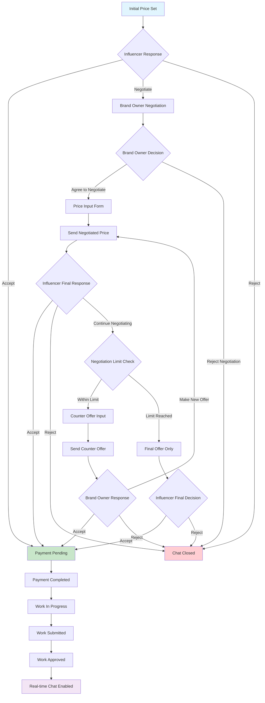
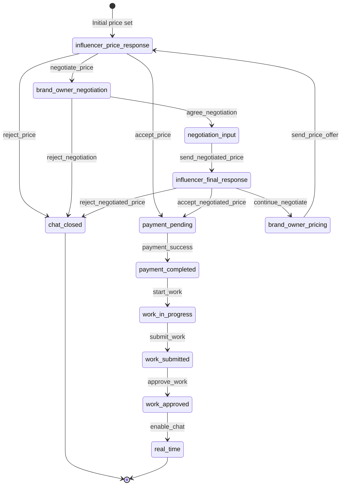
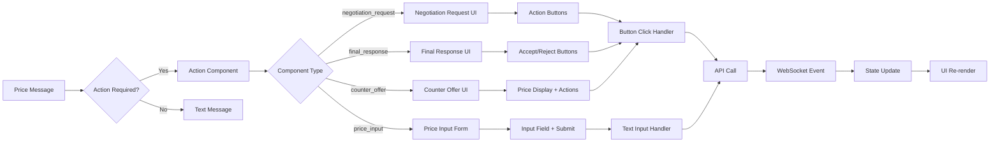
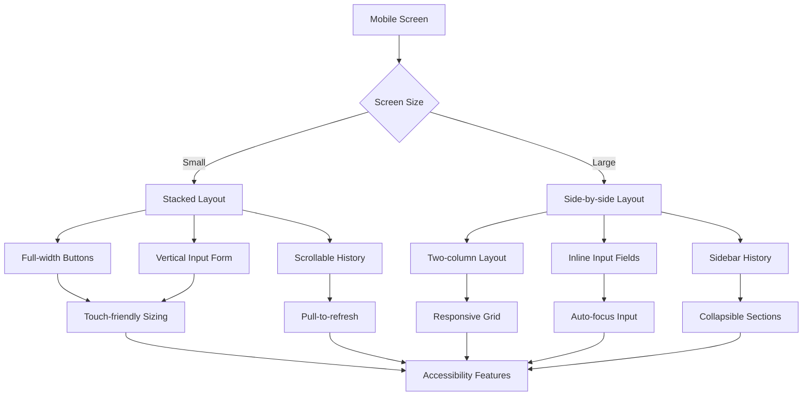
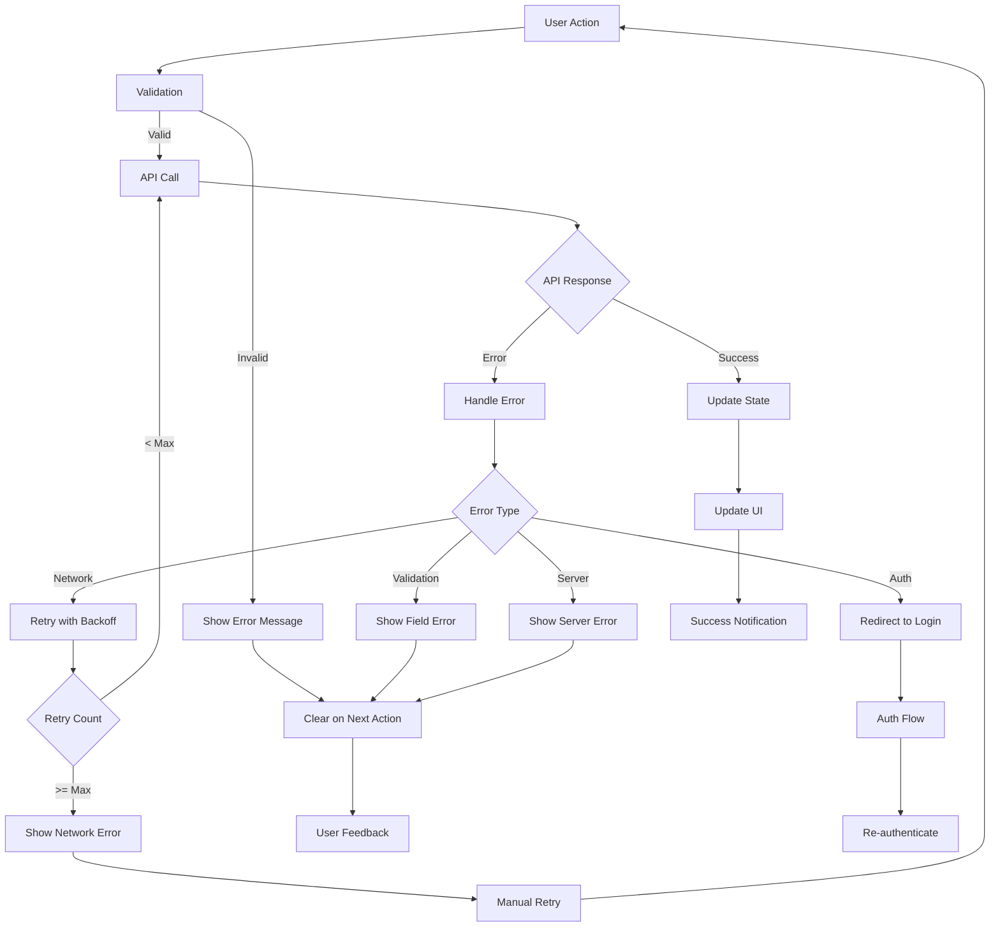
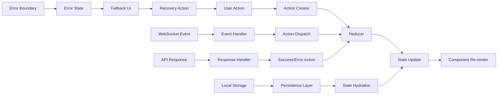
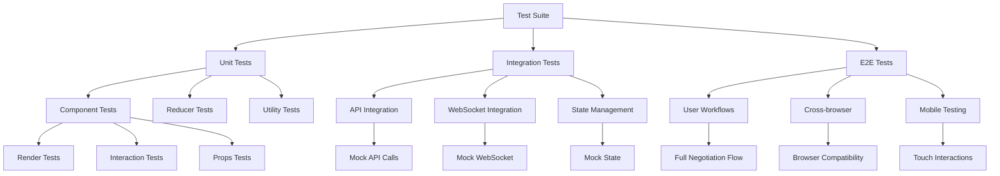

# Negotiation Flow Diagram

This document contains visual diagrams showing the complete negotiation flow implementation.

## 🔄 Complete Negotiation Flow



## 🎯 Negotiation States Detail



## 🔄 Multi-Round Negotiation Flow

```mermaid
sequenceDiagram
    participant I as Influencer
    participant S as System
    participant B as Brand Owner
    
    Note over I,B: Round 1: Initial Negotiation
    
    B->>S: Set initial price (₹3000)
    S->>I: Show price with options
    I->>S: Counter offer (₹5000)
    S->>B: Show negotiation request
    
    Note over I,B: Round 2: Brand Owner Response
    
    B->>S: Agree to negotiate
    S->>B: Show price input form
    B->>S: Send new offer (₹4000)
    S->>I: Show final response options
    
    Note over I,B: Round 3: Final Decision
    
    I->>S: Continue negotiating (₹4500)
    S->>B: Show counter offer
    B->>S: Accept counter offer
    S->>I: Price accepted - proceed to payment
    
    Note over I,B: Payment & Work Flow
    
    B->>S: Complete payment
    S->>I: Payment confirmed - start work
    I->>S: Submit completed work
    S->>B: Work ready for review
    B->>S: Approve work
    S->>I,B: Real-time chat enabled
```

## 🎨 UI Component Flow



## 📱 Mobile UI Flow



## 🔧 Error Handling Flow



## 📊 State Management Flow



## 🧪 Testing Flow



---

These diagrams provide a comprehensive visual representation of the negotiation flow implementation, covering all aspects from user interactions to technical implementation details.
